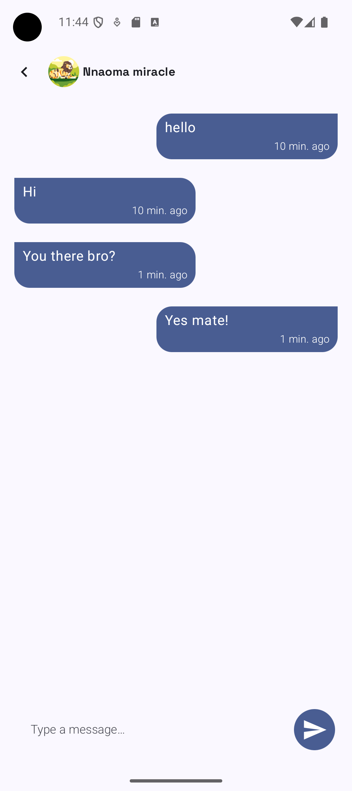

# Real-Time Chat Application (Android)

This project is a real-time 1:1 chat application built as part of the developer assessment. It showcases my skills with Firebase integration, MVVM architecture, Jetpack Compose UI, and clean development practices.

## Features Implemented
* Authentication
    * Email/password sign up and login using    Firebase Authentication.
    * Google signup/login
    * Session persistence and logout support.
* Real-Time Chat
    * Sending and receiving messages instantly using Firebase Realtime Database.
    * Conversations list showing latest messages.
    * Basic unread message count (bug still pending on reset logic).
* Architecture & Code Quality
    * MVVM + Repository pattern.
    * Coroutines + Flow for reactive updates.
    * Dependency injection using Hilt.
    * Room for offline caching.
    * Pagination.
    * Clean modular layering (UI / Domain / Data).
* UI & UX
    * Built with Jetpack Compose + Material 3.
    * Supports dark mode.
    * Basic accessibility considerations.

## Pending / Known Issues
* Read receipts (delivered/read indicators) not yet implemented.
* Unread count reset logic has a bug and is still in progress.
* Extras not included due to time/limitations:
    * Image messaging (blocked by Firebase Storage free-tier restrictions).
    * Automated flows with Firebase Functions (required Blaze plan).
    * Typing indicators, reactions, replies, and push notifications (couldn't implement them due to time).

## Tech Stack Used
* Kotlin + Jetpack Compose (UI)
* Firebase Authentication (Auth)
* Firebase Realtime Database (Chat rooms/live messaging, Conversations list, Users)
* Hilt (Dependency Injection)
* Coroutines & Flow (Async + reactive streams)
* Androidx Paging3 (Pagination)
* Room DB (offline caching/database)
* MVVM + Repository Pattern (Architecture)

## Screenshots

## Setup Instructions
* Clone the repository.
* Add the google-services.json I shared or create a new Firebase project.
* Sync with Gradle and build the project.

## Improvements with More Time
* Fix unread count reset logic.
* Implement read receipts for messages.
* Add image/file messaging with Firebase Storage.
* Integration with Firebase Functions for automation (e.g push notifications, auto conversations update, RTDB triggers).

